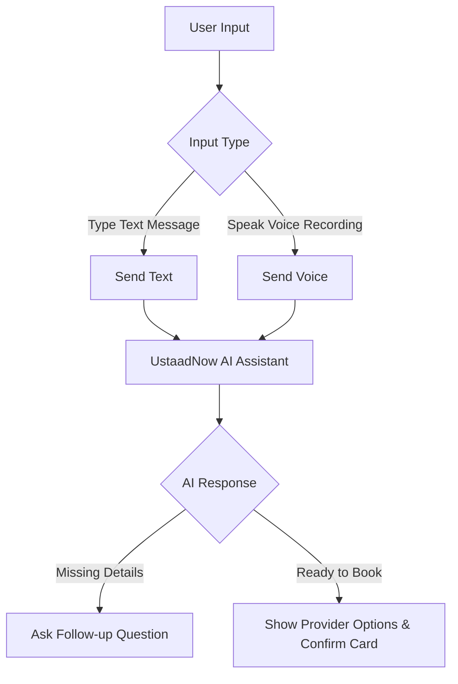
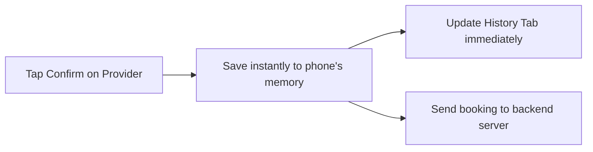

# UstaadNow AI — Feature & Workflow Guide

UstaadNow AI is a conversational voice-activated mobile assistant designed to instantly match users with nearby home service providers (like plumbers, electricians, or AC technicians). 

Here is a simple, non-technical overview of how the app works for users and providers.

---

## 🎙️ 1. Conversational Booking (Text & Voice)
* **How it works**: Users can type or hold the microphone button to speak their request naturally in Urdu, English, or Roman Urdu (e.g., *"AC technician chahiye kal subah G-13 mein"*).
* **Smart Session memory**: The app remembers the context of the current conversation. Even if you switch tabs or put the app in the background, the assistant remembers what you were discussing. You can reset the conversation at any time by tapping the **refresh icon** in the top bar.
* **Friendly Offline Alerts**: If the backend is offline or unreachable, the assistant informs the user directly in the chat with a *"Backend not reachable"* message.

---

## 💬 2. Smart Follow-Up Questions
* **How it works**: If a user's request is missing details (such as where they are located or what time they need the service), the AI will intelligently pause and ask a clarifying question first.
* **Seamless Experience**: The app hides provider lists and options until all necessary booking details are confirmed, ensuring the conversation flows naturally.

---

## ⚡ 3. Instant Booking & Status Synchronization
* **How it works**: As soon as you tap **Confirm** on a provider, the booking is instantly synchronized and saved to your device's local database. 
* **Offline Access**: Because it is saved locally, you can view your booking status and history immediately, without waiting for the internet connection to reload or refresh.
* **Private Views**: The app automatically detects who is logged in. Customers only see their own requested services, and providers only see jobs assigned to them.

---

## 📞 4. One-Tap Phone Calling (InDrive Style)
* **How it works**: Communicating with your matched technician (ustaad) is completely seamless. 
* **Seamless Redirection**: When a booking is confirmed, a phone icon appears next to the provider's details. Tapping this icon automatically opens your phone's pre-filled dialing screen so you can make a phone call instantly, without copying or typing any numbers.
