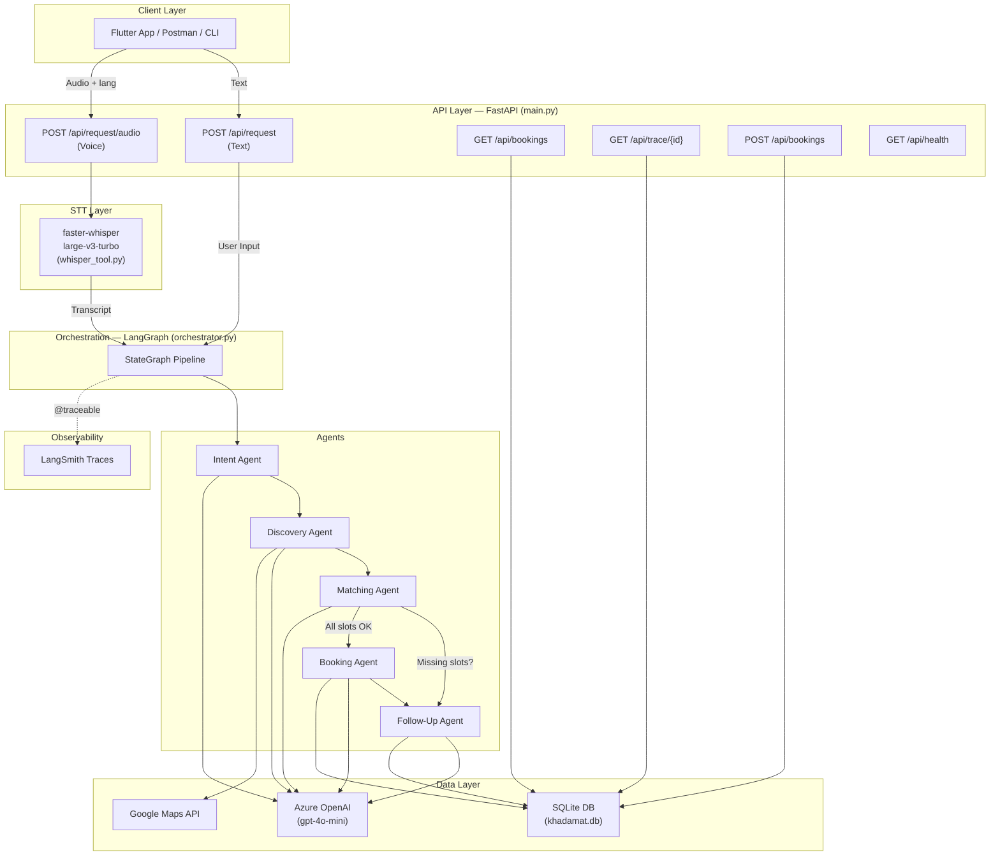
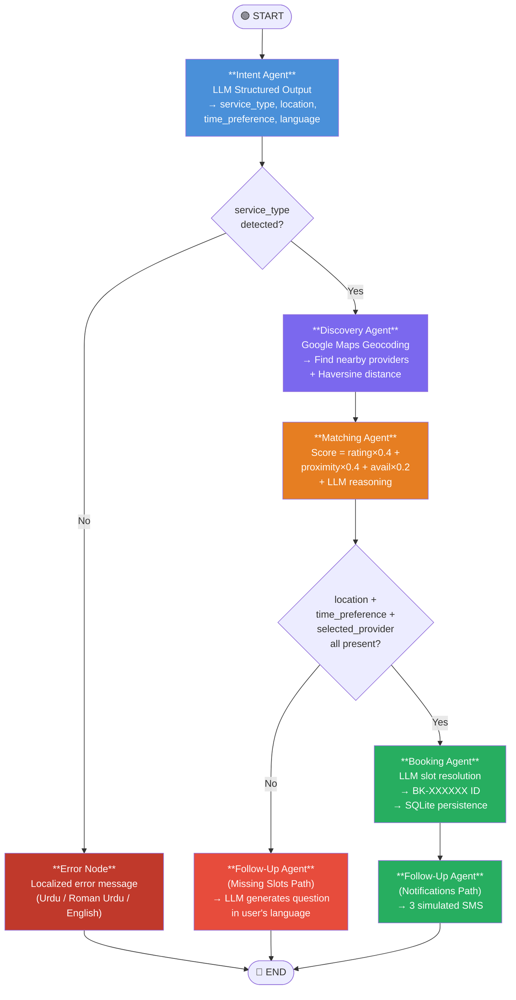
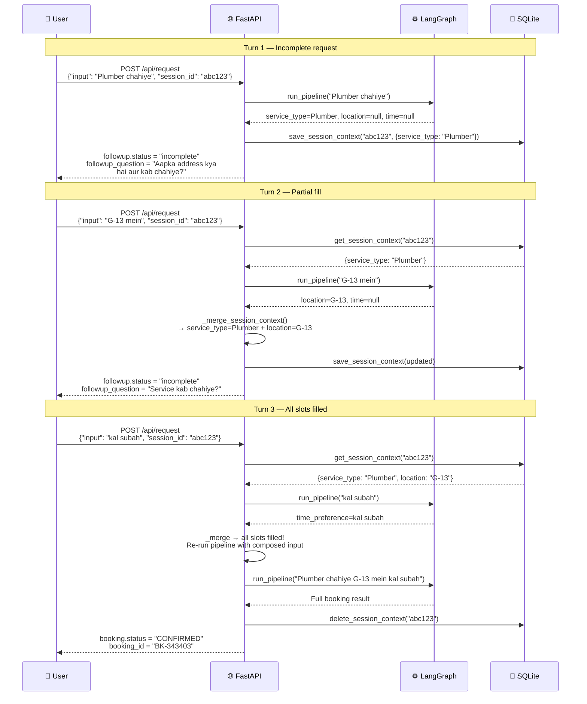
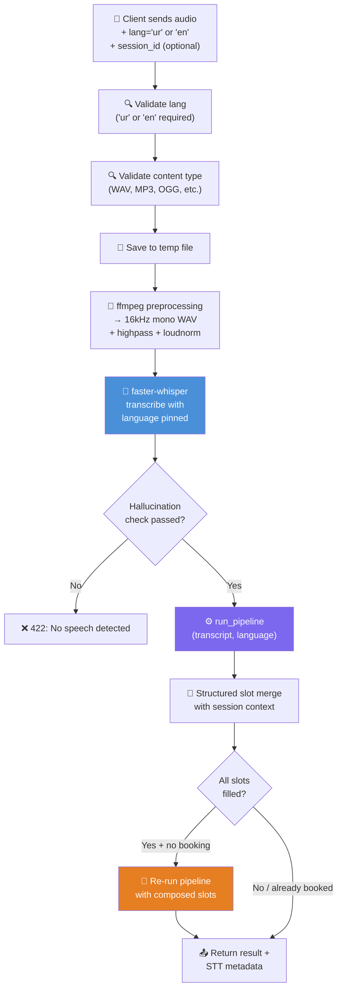
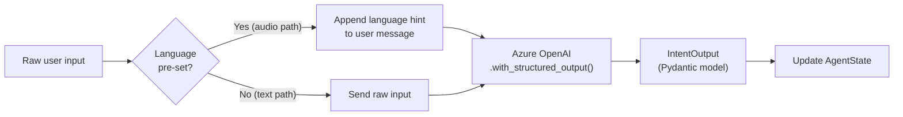
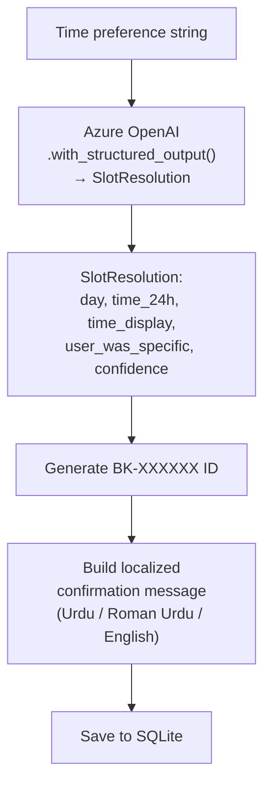
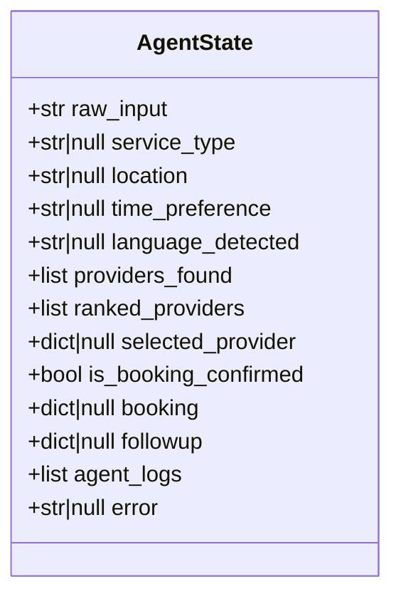
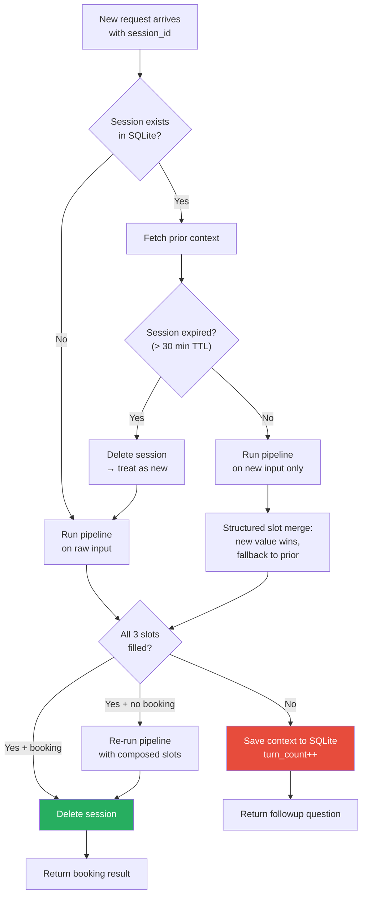
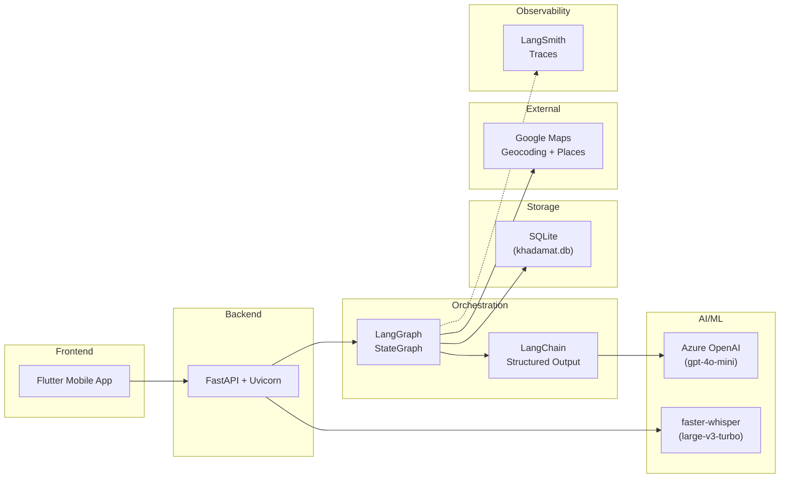

# Khadamat AI — Complete Implementation Plan & Workflow

> Comprehensive reference for hackathon recording / demo walkthrough

---

## 1. High-Level System Architecture



---

## 2. LangGraph Pipeline — Detailed Flow

This is the core of the system. A `StateGraph` passes a shared [AgentState](file:///home/drasmat/Documents/AI%20Hackathon/service-orchestrator/models/schemas.py#44-58) TypedDict through nodes.



---

## 3. Multi-Turn Conversation Flow

When a user doesn't provide all 3 required slots (`service_type`, [location](file:///home/drasmat/Documents/AI%20Hackathon/service-orchestrator/agents/discovery_agent.py#98-139), `time_preference`), the system enters a multi-turn loop.



---

## 4. Audio Pipeline Flow



---

## 5. Agent Details

### 5.1 Intent Agent — [intent_agent.py](file:///home/drasmat/Documents/AI%20Hackathon/service-orchestrator/agents/intent_agent.py)



| Field | Type | Description |
|-------|------|-------------|
| `service_type` | `str or null` | AC Technician, Plumber, Electrician, etc. |
| [location](file:///home/drasmat/Documents/AI%20Hackathon/service-orchestrator/agents/discovery_agent.py#98-139) | `str or null` | G-13, F-10, Bahria Town, etc. |
| `time_preference` | `str or null` | "kal subah", "today afternoon", "8 baje raat" |
| `language_detected` | `str` | "urdu", "roman_urdu", or "english" |

### 5.2 Discovery Agent — [discovery_agent.py](file:///home/drasmat/Documents/AI%20Hackathon/service-orchestrator/agents/discovery_agent.py)

- **Geocodes** user location via Google Geocoding API (biased to Islamabad/Rawalpindi)
- **Searches** for providers via Google Places API → falls back to mock DB
- **Computes** haversine distance from user coords to each provider
- **Returns** top 10 providers sorted by proximity

### 5.3 Matching Agent — [matching_agent.py](file:///home/drasmat/Documents/AI%20Hackathon/service-orchestrator/agents/matching_agent.py)

**Scoring formula:**
```
score = (rating/5.0 × 0.4) + ((1 - distance/10) × 0.4) + (available × 0.2)
```

Then asks Azure OpenAI to generate a human-readable 1-2 sentence reasoning for why the top provider was selected.

### 5.4 Booking Agent — [booking_agent.py](file:///home/drasmat/Documents/AI%20Hackathon/service-orchestrator/agents/booking_agent.py)



**Key feature:** The LLM resolves vague time expressions like "kal subah", "8 baje raat", "parsoon dopahar" into concrete [SlotResolution](file:///home/drasmat/Documents/AI%20Hackathon/service-orchestrator/agents/booking_agent.py#106-129) objects with day + time + confidence.

### 5.5 Follow-Up Agent — [followup_agent.py](file:///home/drasmat/Documents/AI%20Hackathon/service-orchestrator/agents/followup_agent.py)

**Two paths:**

| Path | Trigger | Action |
|------|---------|--------|
| **Missing Slots** | [missing_fields](file:///home/drasmat/Documents/AI%20Hackathon/service-orchestrator/agents/followup_agent.py#237-239) exist, no booking | LLM generates follow-up question in user's language |
| **Post-Booking** | [booking](file:///home/drasmat/Documents/AI%20Hackathon/service-orchestrator/graph/orchestrator.py#236-238) exists | Schedules 3 simulated notifications (2 SMS + 1 reminder) |

Has hardcoded fallback questions in Urdu, Roman Urdu, and English if the LLM call fails.

---

## 6. API Endpoint Specifications

### `POST /api/request` — Text Pipeline

**Request:**
```json
{
  "input": "Mujhe kal subah G-13 mein AC technician chahiye",
  "session_id": "optional-uuid"
}
```

**Response (complete booking):**
```json
{
  "service_type": "AC Technician",
  "location": "G-13",
  "time_preference": "kal subah",
  "language_detected": "roman_urdu",
  "selected_provider": { "name": "Ali AC Services", "rating": 4.8, "..." },
  "booking": {
    "booking_id": "BK-343403",
    "slot_time": "Tomorrow, 10:00 AM",
    "status": "CONFIRMED",
    "confirmation_message": "Aap ki booking..."
  },
  "followup": { "status": "complete", "..." },
  "agent_logs": [ "..." ]
}
```

**Response (incomplete — follow-up needed):**
```json
{
  "service_type": "Plumber",
  "location": null,
  "time_preference": null,
  "followup": {
    "status": "incomplete",
    "missing_fields": ["location", "time_preference"],
    "followup_question": "Aapka address kya hai aur kab chahiye?"
  }
}
```

---

### `POST /api/request/audio` — Audio Pipeline

**Request (FormData):**

| Field | Type | Required | Description |
|-------|------|----------|-------------|
| [audio](file:///home/drasmat/Documents/AI%20Hackathon/service-orchestrator/tools/whisper_tool.py#171-186) | File | ✅ | Audio file (WAV, MP3, OGG, FLAC, M4A, WebM) |
| [lang](file:///home/drasmat/Documents/AI%20Hackathon/service-orchestrator/tools/whisper_tool.py#202-214) | String | ✅ | `"ur"` or `"en"` — pins Whisper language |
| `session_id` | String | ❌ | UUID for multi-turn sessions |

**Response:** Same as `/api/request` plus STT metadata:
```json
{
  "transcript": "Mujhe plumber chahiye G-13 mein",
  "language_detected": "urdu",
  "lang": "ur",
  "whisper_language": "ur",
  "stt_confidence": 0.94,
  "...same fields as text response..."
}
```

---

### `GET /api/bookings` — List All Bookings

Returns array of all confirmed bookings from SQLite.

### `POST /api/bookings` — Direct Booking

**Request:**
```json
{
  "service_type": "Plumber",
  "location": "G-13",
  "time_preference": "tomorrow morning",
  "selected_provider": { "id": "p1", "name": "Ali", "phone": "+92..." },
  "is_booking_confirmed": true
}
```

### `GET /api/trace/{booking_id}` — Agent Trace

Returns the `agent_logs_snapshot` for a specific booking.

### `GET /api/health` — Health Check

Returns `{ "status": "ok" }`.

---

## 7. Data Model — AgentState

The shared state TypedDict that flows through all LangGraph nodes:



---

## 8. Session Context Management



---

## 9. Technology Stack Summary



---

## 10. File-by-File Reference

| File | Role | Key Tech |
|------|------|----------|
| [main.py](file:///home/drasmat/Documents/AI%20Hackathon/service-orchestrator/main.py) | FastAPI server, text + audio endpoints, session merge logic | FastAPI, Uvicorn |
| [orchestrator.py](file:///home/drasmat/Documents/AI%20Hackathon/service-orchestrator/graph/orchestrator.py) | LangGraph StateGraph, node wiring, conditional edges | LangGraph |
| [intent_agent.py](file:///home/drasmat/Documents/AI%20Hackathon/service-orchestrator/agents/intent_agent.py) | LLM structured extraction of service/location/time/language | LangChain `.with_structured_output()` |
| [discovery_agent.py](file:///home/drasmat/Documents/AI%20Hackathon/service-orchestrator/agents/discovery_agent.py) | Geocoding + provider search + haversine distance | Google Geocoding API |
| [matching_agent.py](file:///home/drasmat/Documents/AI%20Hackathon/service-orchestrator/agents/matching_agent.py) | Weighted scoring + LLM reasoning for best provider | Azure OpenAI |
| [booking_agent.py](file:///home/drasmat/Documents/AI%20Hackathon/service-orchestrator/agents/booking_agent.py) | LLM slot resolution + localized confirmations + SQLite persistence | `.with_structured_output()` |
| [followup_agent.py](file:///home/drasmat/Documents/AI%20Hackathon/service-orchestrator/agents/followup_agent.py) | Missing-data questioning + post-booking notification scheduling | Azure OpenAI |
| [whisper_tool.py](file:///home/drasmat/Documents/AI%20Hackathon/service-orchestrator/tools/whisper_tool.py) | STT with ffmpeg preprocessing, CUDA fallback, hallucination filter | faster-whisper |
| [mock_db.py](file:///home/drasmat/Documents/AI%20Hackathon/service-orchestrator/tools/mock_db.py) | SQLite for bookings + session context with TTL | sqlite3 |
| [schemas.py](file:///home/drasmat/Documents/AI%20Hackathon/service-orchestrator/models/schemas.py) | Pydantic models + AgentState TypedDict | Pydantic |
