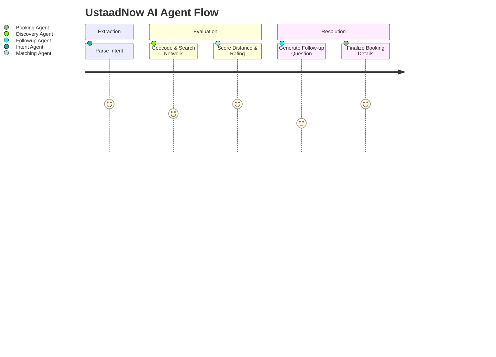

# 🛠️ UstaadNow AI — Project Walkthrough

> **AI-powered informal economy service booking for Pakistan**
> Seamlessly connect with skilled workers using everyday language—voice or text.

---

## 🌟 The Vision

Millions of skilled workers in Pakistan's informal economy—plumbers, electricians, carpenters—rely on word-of-mouth. **UstaadNow AI** gives users a unified, intelligent interface to find the best local professionals simply by asking, in **Urdu**, **Roman Urdu**, or **English**.

> [!TIP]
> **No more clicking through forms:** Just say _"Mujhe kal subah G-13 mein AC technician chahiye"_ and the orchestrator handles the rest—identifying intent, matching providers, calculating a transparent price estimate, and returning booking details including a phone number for direct contact.

---

## 🚀 Core Features

- **🗣️ Multi-Lingual STT:** Powered by `faster-whisper`, perfectly handles noisy audio and Code-Mixed Urdu.
- **🧠 LangGraph Orchestration:** A state-machine of specialized agents for intent extraction, provider discovery, matching, and booking.
- **🔄 Session-Aware Multi-turn Conversations:** If you forget to provide a time or location, the Follow-up agent asks you naturally over multiple turns.
- **📍 Smart Geocoding & Discovery:** Integrates with Google Maps API to turn local neighborhood names (e.g., "Bahria Town") into precise coordinates to find the closest provider.
- **💰 Realistic Pricing Engine:** Since Google Places API does not return pricing for Pakistan's informal economy, the application utilizes a structured mock DB to seed base rates and calculate dynamic price estimates based on the provider's rating index. 

---

## 🗺️ How the AI orchestrates a booking

````carousel
### 1. The Intent
The user provides an unstructured voice note or text.

```json
{
  "input": "AC theek karwana hai",
  "session_id": "user-session-123"
}
```
The **Intent Agent** uses a structured LLM output to parse what it can.
- `service_type`: AC Technician
- `location`: null
- `time_preference`: null

<!-- slide -->
### 2. The Follow-up
The **Follow-Up Agent** notices missing fields and asks the user in their detected language (Roman Urdu):

> _"Aapka address kya hai aur kab chahiye?"_

The API returns:
```json
{
  "followup": {
    "status": "incomplete",
    "missing_fields": ["location", "time_preference"],
    "followup_question": "Aapka address kya hai aur kab chahiye?"
  }
}
```
The state is preserved in SQLite caching.

<!-- slide -->
### 3. Fulfilling requested slots
The user replies to fix the missing details:

```json
{
  "input": "G-13, kal dopahar",
  "session_id": "user-session-123"
}
```
The orchestration re-runs. The **Discovery Agent** tests Google Maps API, falling back to SQLite if needed. The **Matching Agent** then scores nearby providers using proximity and rating!

<!-- slide -->
### 4. Booking Confirmed
The **Booking Agent** picks the best technician, locks in the slot, and outputs a localized confirmation:

> _"Aap ki booking Ali AC Services ke saath Tomorrow, 2:00 PM ko G-13 mein confirm ho gayi hai. Contact: +923001234567"_

Additionally, the system processes a live price estimate based on the provider's quality rating, and the Follow-up agent schedules targeted SMS reminders in the background!
````

---

## 🧩 Architectural deep-dive: The Agentic Pipeline

The system routes user input through highly specialized agents:



### 1️⃣ Intent Agent
Uses Azure OpenAI `.with_structured_output()` to force constraints. Ensures we never get hallucinated service categories.

### 2️⃣ Discovery Agent
Uses **Google Geocoding API** with a spatial bias towards Islamabad/Rawalpindi to precisely map neighborhood names to coordinates. Retrieves providers from the mapped location, defaulting to a mock SQLite database if there are temporary limits on live map queries.

### 3️⃣ Matching Agent
Ranks the discovered providers using a multi-variate formula:
`score = (rating/5.0 * 0.4) + ((1 - min(distance_km, 10)/10) * 0.4) + (0.2 if available else 0.0)`

### 4️⃣ Booking Agent & Follow-up Agent
Acts as the closing node. Evaluates `AgentState` missing parameters. If parameters are missing, outputs an organic conversational question. If complete, securely commits the confirmed appointment to the `ustaadnow.db`. Finally, it provides the end-user with a structured response carrying the provider's contact number and calculated pricing payload.

---

## 🎧 The Audio API

Through `POST /api/request/audio`, users don't even have to type!

> [!NOTE]
> **Audio Pipeline Highlights:**
> 1. Validates dynamic audio payloads (supports wav, m4a, ogg, etc.)
> 2. Normalizes input formats using advanced ffmpeg processing tools
> 3. Transcribes spoken voice in milliseconds via locally-hosted large models (`faster-whisper`), accurately categorizing it as `"ur"` or `"en"`
> 4. Merges the transcribed text intelligently into the ongoing session memory graph

---

## 🎉 Ready for the Hackathon Challenge!

This API structure is fully modular, resilient, and ready for a sleek frontend integration! By bringing transparency and intelligent AI orchestration to Pakistan's informal economy, UstaadNow AI successfully bridges the digital gap for essential home services.
